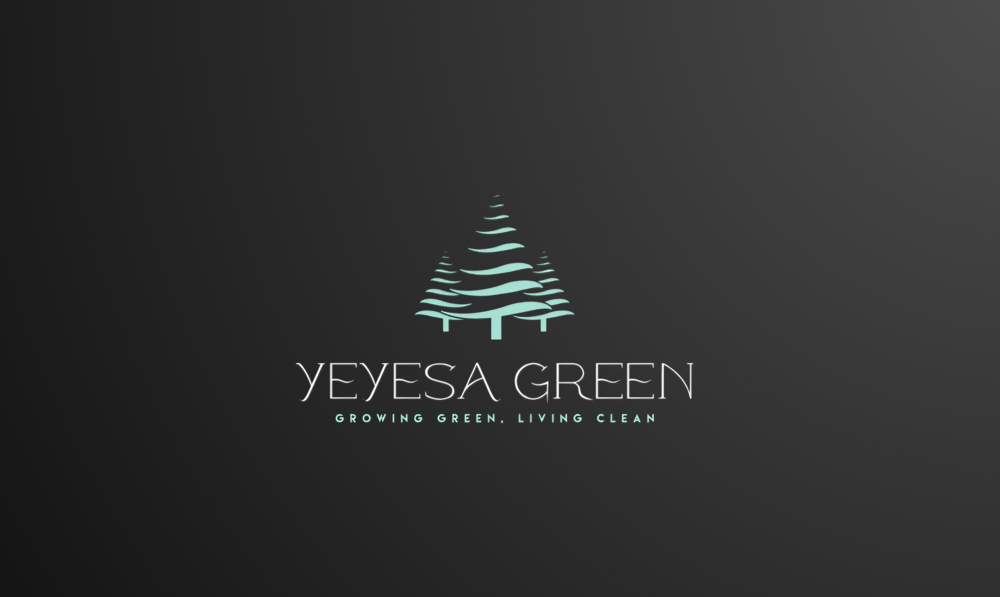

<!DOCTYPE html>
<html lang="en">
<head>
  <meta charset="UTF-8" />
  <meta name="viewport" content="width=device-width, initial-scale=1" />
  <title>Yeyesa Green</title>
  
</head>
<body>

<header>
  
  <nav>
    <a href="#home">Home</a>
    <a href="#about">About</a>
    <a href="#contact">Contact</a>
  </nav>
</header>

<section class="hero" id="home">
  <h1>Welcome to Yeyesa Green</h1>
  
Your sustainable gardening partner.

</section>

<section class="content" id="about">
  <h2>About Us</h2>
  
Yeyesa Green is dedicated to bringing eco-friendly gardening services to your home and community. We specialize in sustainable landscaping, garden design, and maintenance using green practices.

</section>

<section class="contact" id="contact">
  <h2>Contact Us</h2>
  
Email: <a href="mailto:info@yeyesagreen.com">info@yeyesagreen.com</a>

  
Phone: <a href="tel:+27715509075">+27715509075</a>

</section>

<section class="gallery">
  
  
  
</section>

</body>
</html>
